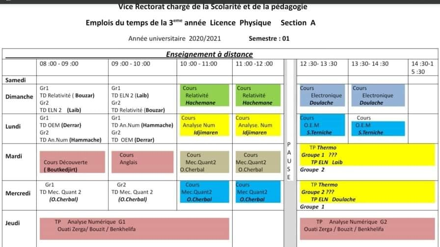

# **L3: Physique Fondamental Section A (2020/2021)**
## **Contact Info**
| Module      | Prof de Cours|Prof de Td|
| ----------- | ----------- |-----------|
| Mécanique Quantique II      | Cherbal <cherbalomar8@gmail.com>|/|
| Analyse Numérique   | Idjimaren <s.idjimarene@gmail.com>|/|       
|Relativité Restreinte| Bouzar <lilabouzar@hotmail.com>|Messamah <jmessamah@usthb.dz>|
|Ondes électromagnétiques| Terniche <sterniche@gmail.com>|Derrar <kaddourz@yahoo.com>|
|Electronique II|Doulache <n.khemicidoulache@gmail.com>|/|
|TP Thermodynamique|/|/|
|TP Analyse Numérique|Ouatizerga <ouabdela@gmail.com>|/|
|Découverte|Boutkedjirt <tarek.boutkedjirt@gmail.com>|/|

## **Links**
- [Facebook](https://www.facebook.com/groups/789143575146217)
- [Discord](https://discord.gg/Zdts7G96)
- [Drive](https://drive.google.com/drive/u/1/folders/1pS6029lu9y5kD9WqpZCOTNkAvNj_dYxr)
- [Moodle de l'USTHB ](https://campusvirtuel.usthb.dz/)
- [Site de la faculté de physique](https://fphy.usthb.dz/)

### **Links Relativité**
- [Moodle RR](https://campusvirtuel.usthb.dz/course/view.php?id=1068)
- [Drive RR](https://drive.google.com/drive/folders/1EFRAG_fNhCzK0ZZPjbiivZ4b9uJKftnv?usp=sharing)

## **Youtube Channels**
- [Youtube Channel Section A](https://www.youtube.com/channel/UCMT8jdFin-68KYbQF12flnQ)
- [YT Channel Doulache (ELN)](https://www.youtube.com/channel/UCDKbiiKT0lYoIVtoVQd3yEQ)

### **Videos made by teachers**
| Module| Lien                               |
|-------|------------------------------------|
|RR     |<ul><li>[Cours 1](https://youtu.be/Ao9-7fZSUQA)</li><li>[Cours 2](https://youtu.be/UjDZhTN9k-s)</li></ul>|
|OEM    |<ul><li>[Cours 1](https://youtu.be/aDjwg0E36q8)</li><li>[TD 1](https://youtu.be/0xxz3eS6RJ0)</li></ul>|
|ELN    |<ul><li>[TP 0](https://youtu.be/kJmrPYVDrSc)</li></ul>|
|TP AN  |<ul><li>[TP 1](https://youtu.be/2wBJpOvK6Gg)</li><li>[TP 2](https://youtu.be/F_jzWTq4P8w)</li><li>[TP 3](https://youtu.be/B4_ed3BCuco)</li></ul>|

## **Program**

